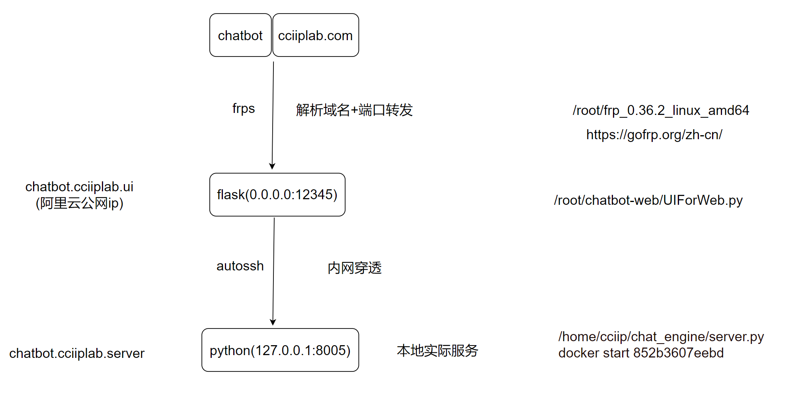

# CCIIP-GPT

LLM in cciiplab 

## data prepare

- instruct_mining 
- openai api
- hust clean

## train language model (lora)(full) 

git-submodule: https://github.com/LZY-the-boys/axolotl (dev) (rl-trainer)

Dependency:  
-  transformers 4.36
-  peft 0.6.0
-  trl 0.7.2
-  bitsandbytes 0.41.2

## train vision model 

qwen-vl: https://github.com/QwenLM/Qwen-VL

train: https://github.com/OpenAccess-AI-Collective/axolotl/tree/llava-train

## eval language model 

Leaderboard:
- lm-eval-harness https://github.com/LZY-the-boys/lm-evaluation-harness-fast (dev)
- helm https://github.com/LZY-the-boys/HELM-Extended-Local (dev)
- human-eval / mbpp
- ceval
- AlpacaEval / MTbench

## eval vision model 

Leaderboard: TODO

## deploy UI

NOTE: currently need to change `sequence_len` in config.json to 8192 to support long conversation

achitecture: 

vllm deploy: https://github.com/LZY-the-boys/vllm
- support gptq and awq
- unknown exllama2 https://github.com/turboderp/exllamav2
- don't support bitsandbytes

language & vision  UI: https://github.com/enricoros/big-agi
- ~~https://github.com/imoneoi/openchat-ui~~
- https://github.com/huggingface/chat-ui

other: https://github.com/billmei/every-chatgpt-gui
