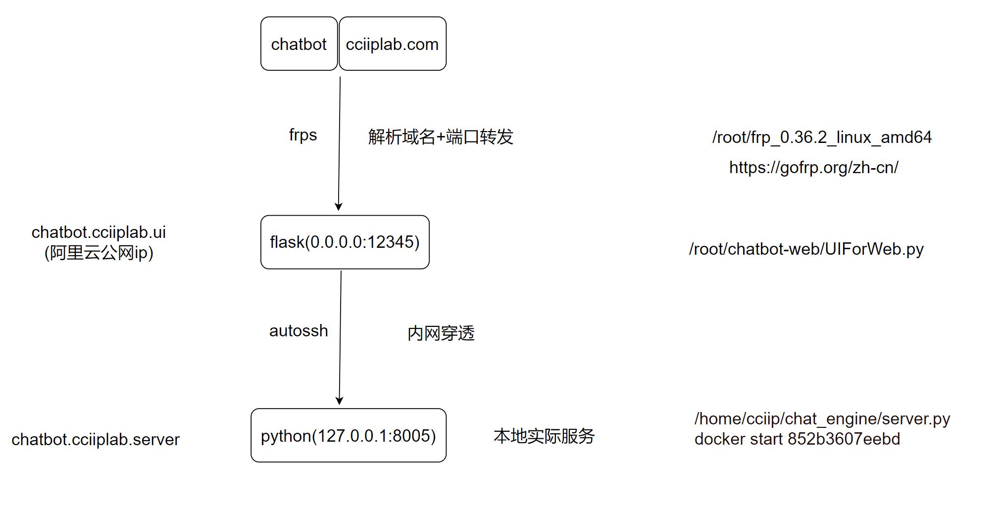

### Design


the client side (WebUI), the url now is : http://8.134.19.195:3000/

We follow the achitecture of http://chatbot.cciiplab.com :



- It will post request to localhost:8000 use openai_api style.
- Currently it is deployed on AliYun server with limited bandwidth (< 2M) and limited storage (< 10G). So it doesn't support image for multi-modal
- Currently the server's system is too old to support nodejs > 18, so temporarily we use `gradio` which only need Python environment.
- The implementation is in [here](client/)
- The autually running code in `/root/gpt.cciip`

the server side: 
- To ensure the compatibility with most web ui, we use `openai_api` style API and `fastAPI` http server.
- To enhance the generation efficiency, we use `vllm` deployment.
- The implementation is in [here](server/)
- The autually running code in lzy@8-4090-128:~/CCIIP-GPT/ui/server.sh

### Start Server

1. install vllm first: 
```
git clone https://github.com/LZY-the-boys/vllm
pip install -e .
source activate vllm
```
2. start server
```
bash vllm.sh
# default start at  http://0.0.0.0:8000
```
3. reverse proxy (autossh)
```
autossh -NR 8.134.19.195:8000:0.0.0.0:8000 -p22 root@8.134.19.195
```

### Start Client

call through [command line](client/openai_client.sh)

call through [http getter](client/openai_client.py)

simple web ui [gradio](client/gradio_web.py)

modern web ui:
- https://github.com/enricoros/big-agi  (need npm >= 18)
    - install nvm first
    - then `nvm install node` or `nvm install 18; nvm use 18`
    - for dev: `npm i` and `npm run dev`; 
    - for release: `npm pack` `npm i --production` `npm start`